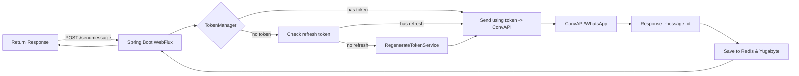
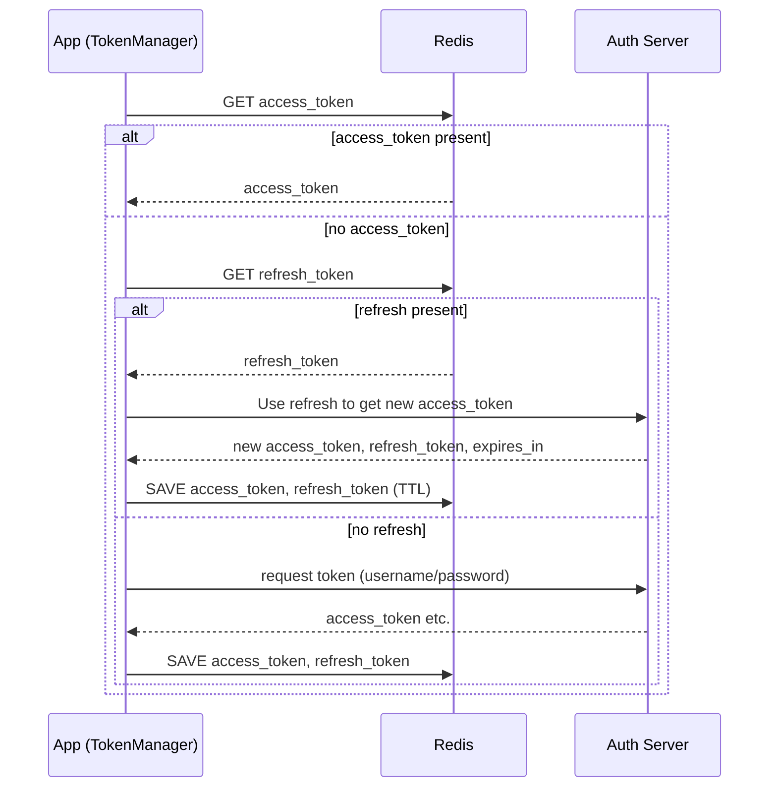
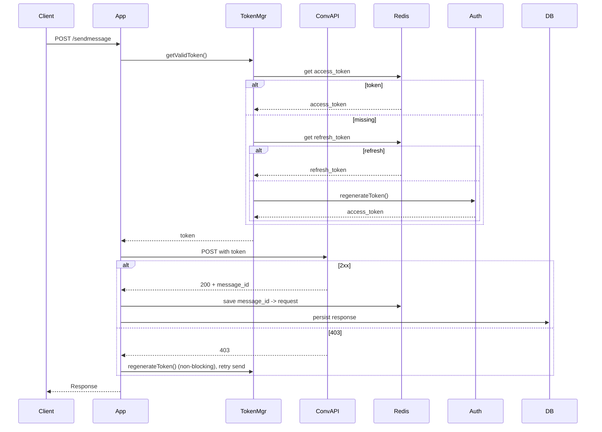

# Flow Diagrams (Mermaid)

## 1. System Overview

```mermaid
graph LR
  A[Client] -->|POST /sendmessage| B[Spring Boot WebFlux]
  B --> C{TokenManager}
  C -->|has token| D[Send using token -> ConvAPI]
  C -->|no token| E[Check refresh token]
  E -->|has refresh| D
  E -->|no refresh| F[RegenerateTokenService]
  F --> D
  D --> G[ConvAPI/WhatsApp]
  G --> H[Response: message_id]
  H --> I[Save to Redis & Yugabyte]
  I --> B
  B --> A[Return Response]
```

## 2. Token lifecycle

```mermaid
sequenceDiagram
  participant App as App (TokenManager)
  participant Redis as Redis
  participant Auth as Auth Server
  App->>Redis: GET access_token
  alt access_token present
    Redis-->>App: access_token
  else no access_token
    App->>Redis: GET refresh_token
    alt refresh present
      Redis-->>App: refresh_token
      App->>Auth: Use refresh to get new access_token
      Auth-->>App: new access_token, refresh_token, expires_in
      App->>Redis: SAVE access_token, refresh_token (TTL)
    else no refresh
      App->>Auth: request token (username/password)
      Auth-->>App: access_token etc.
      App->>Redis: SAVE access_token, refresh_token
    end
  end
```

## 3. Message send + error handling

```mermaid
sequenceDiagram
  participant Client
  participant App
  participant TokenMgr
  participant ConvAPI
  Client->>App: POST /sendmessage
  App->>TokenMgr: getValidToken()
  TokenMgr->>Redis: get access_token
  alt token
    Redis-->>TokenMgr: access_token
  else missing
    TokenMgr->>Redis: get refresh_token
    alt refresh
      Redis-->>TokenMgr: refresh_token
    else
      TokenMgr->>Auth: regenerateToken()
      Auth-->>TokenMgr: access_token
    end
  end
  TokenMgr-->>App: token
  App->>ConvAPI: POST with token
  alt 2xx
    ConvAPI-->>App: 200 + message_id
    App->>Redis: save message_id -> request
    App->>DB: persist response
  else 403
    ConvAPI-->>App: 403
    App->>TokenMgr: regenerateToken() (non-blocking), retry send
  end
  App-->>Client: Response
```